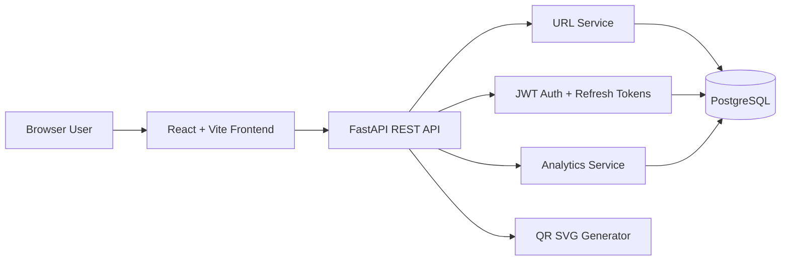

# Architecture

## Backend Layers

- `core`: settings, database, security helpers
- `models`: SQLAlchemy database models
- `schemas`: Pydantic request and response contracts
- `services`: business logic and database operations
- `api/v1`: HTTP routers and dependency wiring

## Frontend Layers

- `services/api.js`: Axios client and token refresh
- `context/AuthContext.jsx`: auth state
- `pages`: route-level screens
- `components`: reusable dashboard and analytics UI

## Security Architecture

- Passwords are hashed with bcrypt through Passlib.
- Access tokens are short-lived JWTs.
- Refresh tokens are stored server-side as SHA-256 hashes.
- SQLAlchemy parameterization protects database queries.
- Pydantic validates request payloads.
- CORS is environment-configurable.
