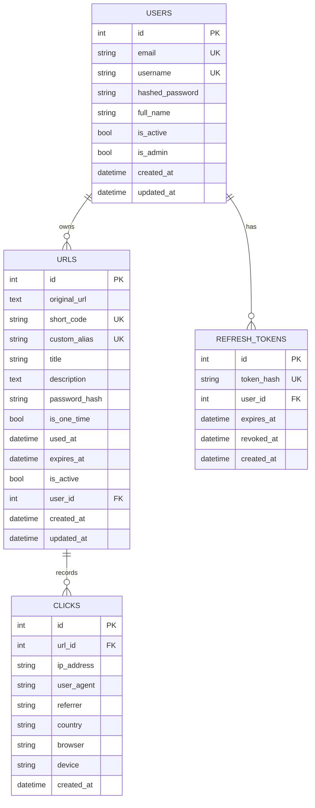

# Database Schema

## Indexes

- `users.email`
- `users.username`
- `urls.short_code`
- `urls.custom_alias`
- `urls.user_id, urls.created_at`
- `urls.user_id, urls.is_active`
- `clicks.url_id, clicks.created_at`
- `refresh_tokens.token_hash`
